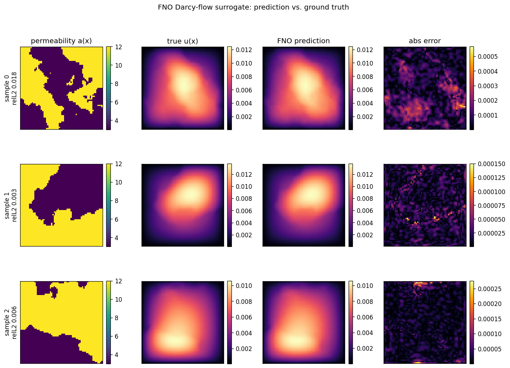

# physics-surrogate-ddp

A machine-learning surrogate for **Darcy flow**: a Fourier Neural Operator (FNO)
trained to map random permeability fields `a(x)` to pressure solutions `u(x)`
of the PDE `-div(a grad u) = f`, replacing a numerical solver with fast
neural inference. Training scales from one GPU to many with **PyTorch DDP**
(data-parallel) or **FSDP / ZeRO-3** (sharded), plus gradient accumulation and
mixed precision — with no code changes between modes.

Why this problem: field-to-field operator learning on PDE data is the core
workload behind AI-accelerated engineering simulation. The dataset here is
generated from scratch with a finite-volume solver (harmonic face averaging,
correct for discontinuous coefficients), so the whole pipeline — data
generation, model, distributed training, evaluation — is self-contained and
reproducible.



## Quickstart

```bash
pip install -r requirements.txt

# 1. Generate data (~1200 solved PDE instances at 64x64)
python -m src.data.darcy --n-samples 1200 --grid 64 --out data/darcy_train.npz

# 2a. Train on a single GPU (or CPU)
python -m src.train --data data/darcy_train.npz --epochs 100 --amp

# 2b. Train on 2 GPUs with DDP (data-parallel)
torchrun --standalone --nproc_per_node=2 -m src.train \
    --data data/darcy_train.npz --epochs 100 --amp

# 2c. Train sharded with FSDP (ZeRO-3) — for models too big to replicate
torchrun --standalone --nproc_per_node=2 -m src.train \
    --data data/darcy_train.npz --epochs 100 --amp --parallel fsdp

# 3. Evaluate + render prediction figure
python -m src.infer --checkpoint checkpoints/fno_darcy.pt --data data/darcy_train.npz
```

Metric: **relative L2 error** `||u_pred - u|| / ||u||`, the standard
neural-operator benchmark metric. On 2× T4 GPUs this model reaches
**1.4–1.6% validation relative L2** at 64×64 (100–150 epochs).

**Running on GPUs (Kaggle free 2× T4, DGX Spark, rented cloud):** see
[GPU_GUIDE.md](GPU_GUIDE.md) and the ready-to-run
[notebooks/kaggle_2xT4.ipynb](notebooks/kaggle_2xT4.ipynb).

## Distributed training: what's implemented and when to use it

Four independent knobs, because "distributed training" is not one technique —
it's a set of trades between **speed**, **memory**, and **batch size**:

| Technique | Flag | What it trades | Use it when |
|-----------|------|----------------|-------------|
| **DDP** (data parallel) | `--parallel ddp` | Replicates the model per GPU; all-reduces gradients each step | The model fits on one GPU and you want **speed**. Default. |
| **FSDP** (ZeRO-3, sharded) | `--parallel fsdp` | Shards params, grads *and* optimizer state across ranks; all-gathers layer-by-layer during forward/backward | The model **doesn't fit** on one GPU. Buys memory, costs communication. |
| **Gradient accumulation** | `--grad-accum N` | N micro-batches per optimizer step | You need a large **effective batch** but lack the memory for it. |
| **Mixed precision** | `--amp` | fp16 compute with loss scaling | Always, on tensor-core GPUs — roughly halves memory and speeds up the FFTs. |

Key implementation details worth reading the code for:

- **FSDP wraps each `FNOBlock` as its own shard unit** (size-based auto-wrap), so
  only one block's full parameters are materialised at a time — that's what makes
  the memory saving real rather than nominal.
- **Checkpointing under FSDP is a collective**: parameters live in shards, so
  every rank must enter `FSDP.state_dict_type(FULL_STATE_DICT, rank0_only=True)`
  to gather a single complete checkpoint on rank 0. Saving only on rank 0 without
  the gather silently writes a shard.
- **Gradient accumulation uses `no_sync()`** on non-step micro-batches. Without
  it DDP all-reduces gradients on *every* micro-batch, so accumulation would
  multiply communication instead of amortising it.
- **AMP under FSDP needs `ShardedGradScaler`**, not the plain `GradScaler` —
  gradients are sharded, so unscaling has to be shard-aware.
- **FSDP requires a CUDA device.** Torch refuses to initialise it on CPU, so the
  code raises an actionable error pointing at `--parallel ddp` instead.

## Scaling benchmark

The whole point of the DDP work is a measured scaling result. One command runs
the same training on 1 and 2 GPUs and emits the table:

```bash
# throughput scaling curve (writes scaling.md + docs/scaling.png)
python -m src.benchmark --data data/darcy_train.npz --gpus 1,2,4 --epochs 100 --amp

# DDP vs FSDP at the same world size — compare peak memory per GPU
python -m src.benchmark --data data/darcy_train.npz --gpus 2 --parallel ddp,fsdp --amp

# compute-bound preset: scaling gets closer to linear as the model grows
python -m src.benchmark --data data/darcy_train.npz --gpus 1,2 --size large --amp
```

Measured on Kaggle **2× Tesla T4**, 1200 samples at 64×64, 100 epochs, AMP,
per-GPU batch 16:

| Strategy | GPUs | epoch time (s) | throughput (samples/s) | peak mem/GPU (MB) | val relL2 | speed-up |
|----------|------|----------------|------------------------|-------------------|-----------|----------|
| single GPU | 1 | 1.14 | 951 | 192 | 0.0144 | 1.00× |
| DDP ×2 | 2 | 0.77 | 1,411 | 202 | 0.0167 | 1.48× |

**Scaling analysis.** Two GPUs give a **~1.5× throughput speed-up** (epoch time
1.14s → 0.77s; repeat runs on shared Kaggle hardware land between 1.48× and
1.55×) — sub-linear, and honestly so. The model is small (2.4M params) and each
epoch is only ~1s, so the per-step NCCL gradient all-reduce and the fixed DDP
overhead are a non-trivial fraction of the step; there simply isn't enough
compute per GPU to fully hide communication at this size. Larger models or
higher resolution (`--size large`, or 128×128 data) push the
compute/communication ratio up and the speed-up toward linear.

**Note the memory column: DDP does not reduce per-GPU memory** (192 → 202 MB;
the small rise is comm buffers). That is the defining limitation of data
parallelism — every rank holds a *full* replica, so a model that OOMs on one GPU
OOMs on all of them. Sharding (`--parallel fsdp`) is the answer to that problem,
and the reason both strategies are implemented here.

The 2-GPU val error is slightly higher (0.0167 vs 0.0144) because DDP **doubles
the effective batch** (16 → 32) while epochs are held fixed, so the model takes
half as many optimizer steps — the classic large-batch effect. Training the
2-GPU run longer (150 epochs) recovers it to **0.0158**; the textbook fix is the
linear LR scaling rule (raise LR ~2× with the batch). Being able to explain both
the sub-linear speed-up *and* the accuracy gap is the point of the exercise — see
[GPU_GUIDE.md](GPU_GUIDE.md).

> The benchmark launches ranks via environment variables rather than `torchrun`.
> That path is identical to what torchrun does (same NCCL init), but it also
> runs on macOS/CPU for local testing, where `torchrun --standalone` can hang on
> IPv6 loopback rendezvous.

## Design decisions (and why)

The questions a reviewer will ask, answered:

- **Why harmonic averaging of permeability at cell faces?** The permeability is
  piecewise-constant (two-phase media), so it's *discontinuous* at phase
  boundaries. Flux continuity across a face between cells of permeability `a_i`
  and `a_j` is preserved by the **harmonic** mean `2 a_i a_j / (a_i + a_j)`, not
  the arithmetic mean — the arithmetic mean lets a high-permeability cell
  dominate a low one and produces the wrong flux (and wrong solution) across
  interfaces. This is the standard finite-volume treatment for discontinuous
  coefficients.

- **Why relative L2, not MSE?** The solution magnitude varies sample-to-sample
  with the permeability field. Normalising the error by `||u||` makes it
  scale-invariant, comparable across samples and across grid resolutions, and it
  is the metric the FNO literature (Li et al., 2021) reports — so numbers are
  directly comparable to published results.

- **Why `sampler.set_epoch(epoch)`?** `DistributedSampler` shards the dataset
  across ranks and shuffles deterministically from a seed. Without
  `set_epoch`, every epoch uses the *same* shuffle, so each rank sees the same
  order forever — you lose the regularisation benefit of shuffling. Calling it
  per epoch reseeds the shuffle identically on all ranks (so shards stay
  disjoint) while varying it across epochs.

- **How does DDP's all-reduce work?** Each rank holds a full model replica and
  computes gradients on its own data shard. During `backward()`, DDP
  **all-reduces** (averages) the gradients across ranks — overlapping the
  communication with backprop by bucketing gradients — so every replica ends the
  step with identical averaged gradients and the optimizer keeps them in sync.
  Effective batch size = per-rank batch × world size. In this repo the *metric*
  is also all-reduced (`ReduceOp.AVG`) so the logged val relL2 is the true global
  average, and the sample count is all-reduced (`SUM`) for correct global
  throughput.

- **How is FSDP different from DDP?** DDP keeps a **full replica** of the model
  on every GPU — memory scales with the number of GPUs only in *activations*, not
  parameters, so a model that doesn't fit on one GPU doesn't fit on eight. FSDP
  (ZeRO-3) **shards** parameters, gradients, and optimizer state across ranks;
  each layer's full weights are all-gathered just in time for its forward/backward
  and freed immediately after. That cuts per-GPU memory roughly by the world size
  at the cost of extra communication (all-gather + reduce-scatter instead of one
  all-reduce). Rule of thumb: **DDP for speed when it fits, FSDP when it doesn't.**

- **Why does gradient accumulation need `no_sync()`?** DDP hooks gradient
  all-reduce onto `backward()`. If you accumulate over N micro-batches naively,
  you pay N all-reduces per optimizer step — accumulation would *increase*
  communication. `no_sync()` suppresses the sync on the first N−1 micro-batches so
  gradients accumulate locally and reduce once, at the step.

- **Why spectral convolutions / why is the FNO resolution-invariant?** An FNO
  layer multiplies the lowest Fourier modes of the input by learned complex
  weights (a global convolution), then inverse-transforms. Because it
  parameterises the operator in Fourier space over a fixed number of *modes*
  (not a fixed pixel grid), the same trained weights apply at any resolution —
  verified by a test that runs the model at 32×32 and 48×48 with one set of
  weights.

- **Why AMP / cosine LR / AdamW?** Mixed precision (`--amp`, CUDA only) roughly
  halves memory and speeds up the FFT-heavy forward pass on tensor-core GPUs;
  cosine annealing gives a smooth LR decay that reaches lower final error than a
  constant LR; AdamW's decoupled weight decay is the standard regulariser for
  this model family.

## Tests

```bash
python -m pytest -q
```

- **Solver** (`test_darcy.py`): positivity, symmetry, and linearity of the
  discretisation (`u` scales inversely with permeability).
- **Model** (`test_fno.py`): spectral-conv shapes, gradient flow, resolution
  invariance, and — as regressions for two real bugs — a forward pass under AMP
  autocast and a full `GradScaler` step (complex weights previously broke both).
- **Training** (`test_train.py`): end-to-end single-process run of the loop.
- **Distributed** (`test_distributed.py`): a real **two-rank DDP** training run
  (spawned subprocesses, gloo), gradient accumulation, the FSDP-on-CPU guard,
  and table/plot rendering. The two-rank **FSDP** test runs only where CUDA is
  available — torch refuses to initialise FSDP without an accelerator.

CI runs the suite on every push.

## Layout

```
src/data/darcy.py    # GRF sampling + finite-volume Darcy solver + dataset generation
src/models/fno.py    # SpectralConv2d / FNO2d
src/train.py         # DDP + FSDP training loop, AMP, grad accumulation, metrics JSON
src/benchmark.py     # scaling across world sizes & strategies -> table + plot
src/infer.py         # eval a checkpoint + render prediction/ground-truth/error figure
tests/               # solver, model, training, and distributed (multi-rank) tests
notebooks/           # ready-to-run Kaggle 2x T4 benchmark notebook
Dockerfile           # CUDA runtime image for cloud GPU boxes
GPU_GUIDE.md         # how to run on Kaggle / DGX Spark / rented cloud
```
